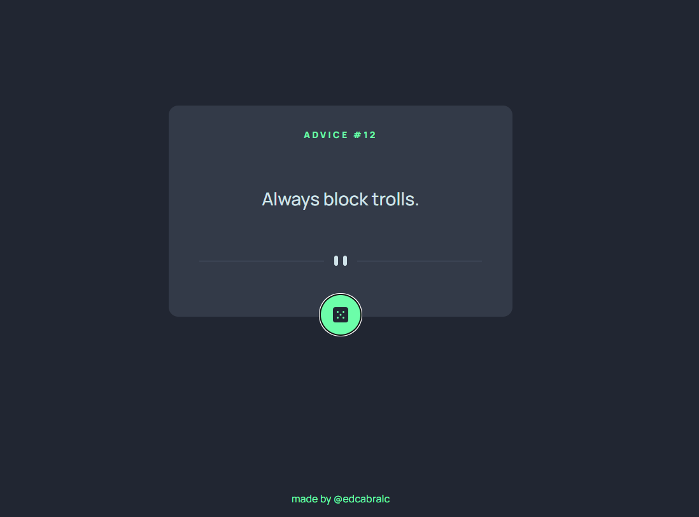

# Projeto Advise Challenge - Frontend Mentor

Este é um projeto simples desenvolvido com Next.js, onde você pode obter uma citação aleatória de uma API e usar o `AbortController` para cancelar requisições anteriores caso uma nova seja feita antes da anterior ser concluída.



## Tecnologias Utilizadas

- **Next.js**: Framework para React
- **React**: Biblioteca JavaScript para criar interfaces de usuário
- **AbortController**: API JavaScript para cancelar requisições assíncronas (fetch)
- **Hooks (useState, useEffect)**: Para gerenciar estados e efeitos colaterais

## Funcionalidade

- O projeto permite obter uma citação aleatória de uma API externa.
- Caso o botão seja clicado novamente antes de a requisição anterior ser concluída, a requisição em andamento será cancelada e uma nova será iniciada.

## Como Rodar o Projeto

1. Clone o repositório para sua máquina local:

```bash
git clone https://github.com/seu-usuario/nome-do-repositorio.git
```

2. Instale as dependências do projeto:

```bash
npm install
```

3. Execute o servidor de desenvolvimento:

```bash
npm run dev
```

4. Acesse o projeto no navegador através de:

```bash
http://localhost:3000
```

## Contribuições

Sinta-se à vontade para fazer contribuições para este projeto! Se você tiver sugestões ou correções, fique à vontade para abrir uma issue ou enviar um pull request.

Feito com muita dedicação 🚀
